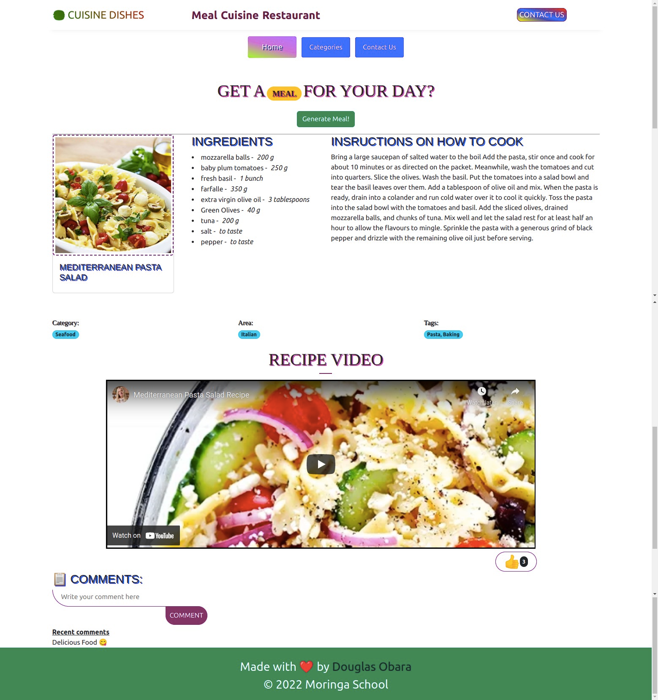
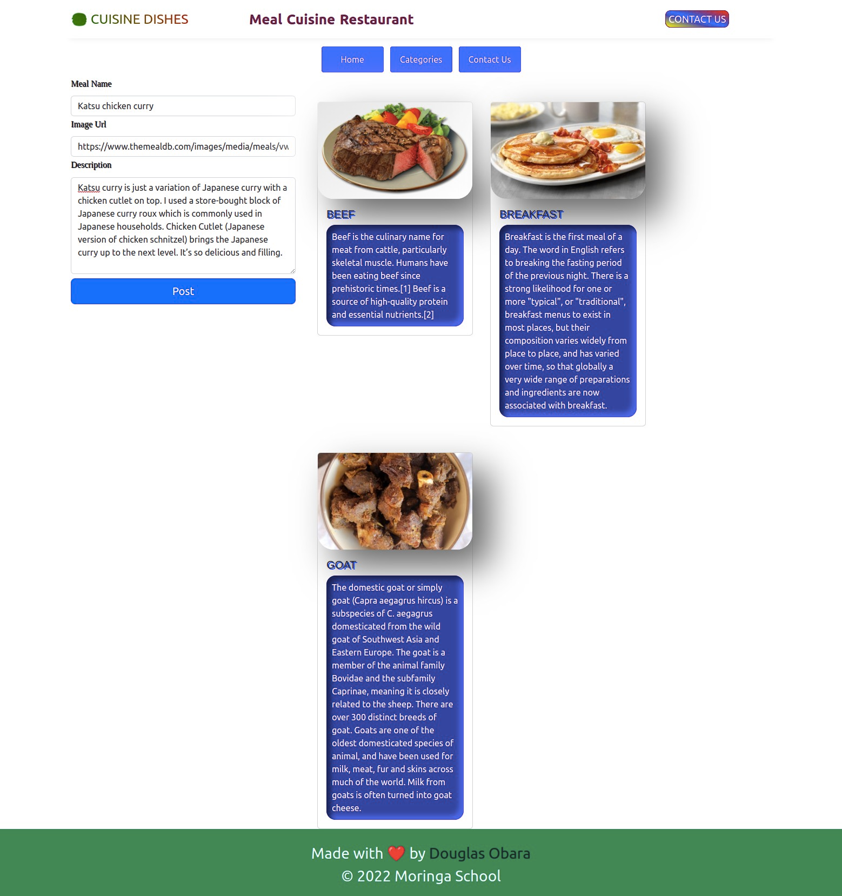
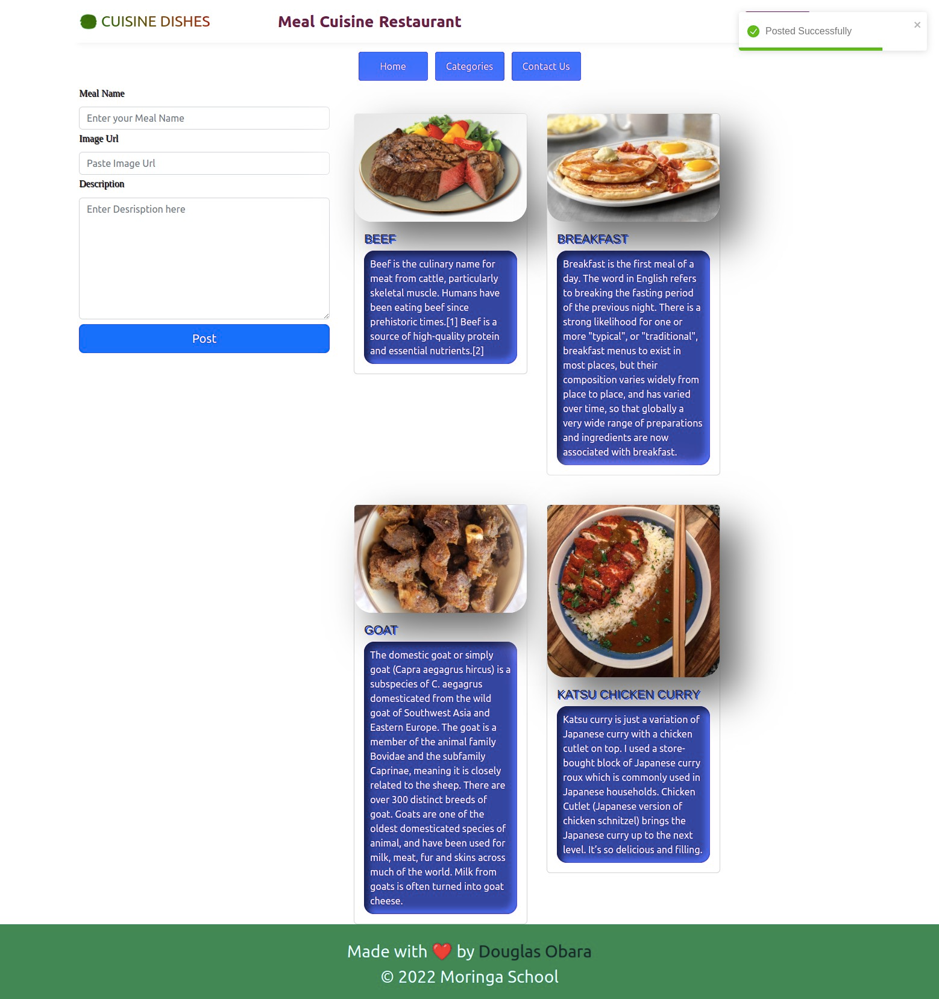

# Phase 2 Final Project : Meal Cuisine Restaurant

## Learning Goals 👨‍🚀

- Access information from an API using a `GET` request and use it to update the
  DOM
- Listen for user events and update the `DOM` in response
- Fetch the information from user input and use `POST` method to submit data to local db server
- Be well conversant with the React JS library for building the user interface components
- Follow good coding practices by keeping code DRY(Do not repeat yourself) by utilizing functions to abstract repetitive code

## Introduction 🚀

This is a restaurant called `CUISINE DISHES` that educates people on how to cook different kinds of foods from different countries and showing them the name of the meal, Ingredients to use, Instructions on how to cook and the video tutorial to showcase how the meals are prepared by differents experts in the field, in addition users can be able to like and comment about the video tutorial.On the categories page users are able to see different meal categories of the restaurant and can add their own categories using the add own category button on the top left corner

## Screenshots 📸

- This the final project design
  <a href="https://meal-cuisine-restaurant.herokuapp.com/">
  <a>

### Categories Page
  <a href="https://meal-cuisine-restaurant.herokuapp.com/"> 
   <a>

### Add your Own Categories Section [POST METHOD]
  <a href="https://meal-cuisine-restaurant.herokuapp.com/"> 
   <a>

### Posted Successful [GET METHOD]
  <a href="https://meal-cuisine-restaurant.herokuapp.com/"> 
   <a>

## Setup ✴️

- [x] Clone the repository using `https://github.com/Douglas254/Phase2-Final-Project.git` or download and extract the zip file.
- [x] Open up the cloned folder in your preferred text editor. Open up a terminal within your workspace and navigate into the Phase2-Final-Project folder
- [x] Within that folder, run `npm install` which will install all dependencies for you then run `npm run server` to run the json-server for your backend.
- [x] Finally open a new terminal while keeping base URL for your backend running on `http://localhost:5000/categories` then run `npm start` and if prompted click y or yes thereafter you should get the default react-app running on http://localhost:5001 :boom:

## Endpoints API 🛠️

Your base URL API for storing categories in db.json: `http://localhost:5000/categories`

✅ [TheMealDBAPI](https://www.themealdb.com/api.php)

## Core Deliverables 📈

As a user 👨‍💻, I can:

- Be able to generate a random meal using the `Generate Meal!` button
- Be able to view the procedures for cooking a certain type of food
- Watch a video tutorial for preparation of the displayed food
- Be able to comment on a type of food that is displayed and give it a like 👍
- See different meal categories on the website restaurant
- Add my own meal categories using `POST` method using the form provided on Categories page and `GET` the meal displayed instantly on the browser
- See the location of the resaturant using Map on the Contact page

## Deployment ~ Heroku 🌍

View hosted site [here](https://meal-cuisine-restaurant.herokuapp.com/)

## Authors 🖊️

This project was contributed to by:

- [Douglas Obara](https://github.com/douglas254/)

## License 📄

The project is licensed under MIT
